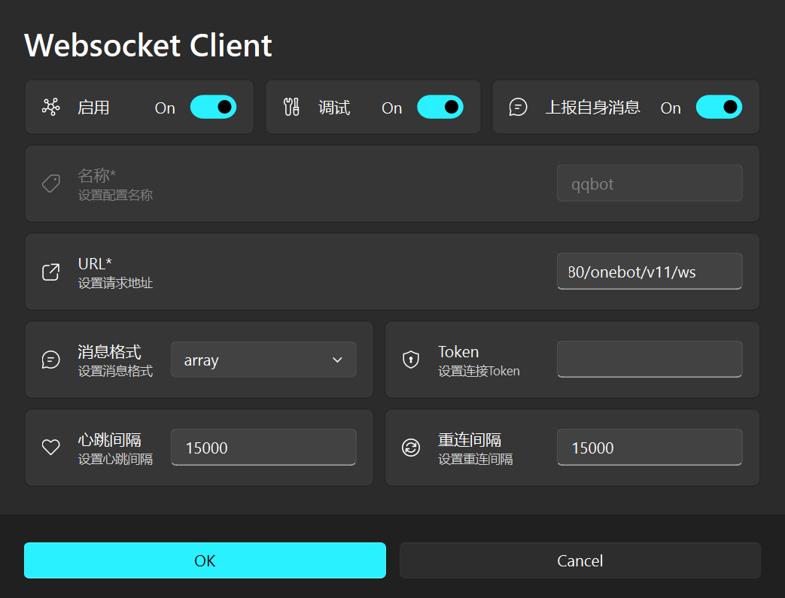
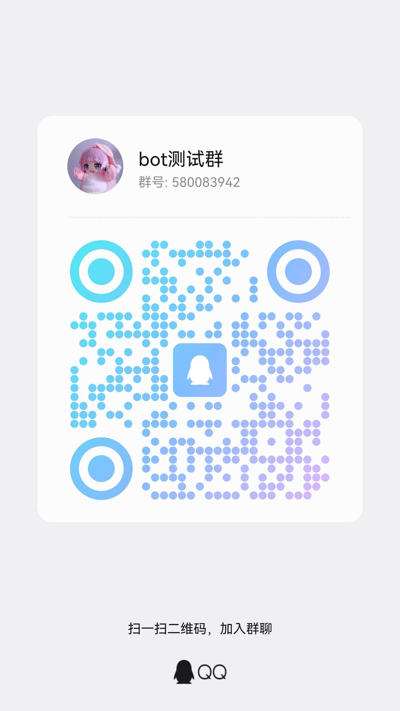

# QQ Bot 多角色扮演系统

基于 NoneBot2 + DeepSeek API + NapCat 的多角色扮演 QQ 机器人，支持语料采集 → Skill 蒸馏 → 实时切换，内置联网搜索和中文 Web 管理面板。

## 架构

```
QQ 客户端 ←→ NapCat (OneBot v11) ←WebSocket→ NoneBot2 (port 8080)
                                                      ↕
                                                zyw_chat 插件
                                                ├─ DeepSeek / OpenAI API
                                                └─ 百度+微博+搜狗+DDG 联网搜索

Dashboard (port 8501) ←→ 进程管理 / 语料采集 / Skill 蒸馏 / 头像管理 / 热重载
```

## 新手上路

### 前置条件

在开始之前，请确保你的电脑已安装以下软件：

| 软件 | 要求 | 下载 |
|------|------|------|
| Python | 3.10+，安装时**务必勾选** "Add to PATH" | [python.org](https://www.python.org/) |
| QQ 桌面版 (QQNT) | 最新版 | [im.qq.com](https://im.qq.com/) |
| NapCat | 最新版 OneKey 版 | [NapCatQQ Releases](https://github.com/NapNeko/NapCatQQ/releases) |
| DeepSeek API Key | 注册后在 API Keys 页面创建 | [platform.deepseek.com](https://platform.deepseek.com) |
| Git | 任意版本 | [git-scm.com](https://git-scm.com/) |

> 本项目仅支持 **Windows** 系统。Mac/Linux 用户需自行调整 bat 脚本和 NapCat 版本。

### 安装步骤

**第一步：克隆仓库**

在任意目录下打开终端（CMD 或 PowerShell），执行：

```bash
git clone https://github.com/KP-i2/qqbot-multiple-character.git
cd qqbot-multiple-character
```

> 以下所有操作都在 `qqbot-multiple-character` 目录内进行。

**第二步：运行安装脚本**

双击 `setup.bat`（或在终端中执行 `setup.bat`），脚本会自动完成：

- 检测 Python 版本
- 创建虚拟环境 `skill_qqbot/`
- 安装所有 Python 依赖
- 从模板生成配置文件 `qqbot/.env`

如果看到 "环境部署完成！" 字样，说明安装成功。

**第三步：编辑配置文件**

用任意文本编辑器打开 `qqbot/.env`，填入以下必填项：

```ini
# 必填 —— 从 platform.deepseek.com 获取
DEEPSEEK_API_KEY=sk-你的密钥

# 必填 —— 你的 QQ 号（用于管理员权限）
ADMIN_QQ=你的QQ号

# 建议修改 —— Dashboard 管理面板的登录密码
DASHBOARD_TOKEN=自定义一个密码

# 启动时的默认角色编号（761 为示例角色，可改成你自己的）
DEFAULT_SKILL=761
```

> 其余配置项保持默认即可，后续可在 Dashboard 中动态调整。

**第四步：安装 NapCat**

1. 从 [NapCatQQ Releases](https://github.com/NapNeko/NapCatQQ/releases) 下载 `NapCat.Shell.Windows.OneKey.zip`
2. 将 zip 内的 `NapCat.xxxxx.Shell` 文件夹解压到本项目的 `qqbot/napcat/` 目录下
3. 最终目录结构应为：`qqbot/napcat/NapCat.xxxxx.Shell/NapCatWinBootMain.exe`（`xxxxx` 为版本号，如 `44498`）
4. 运行 `setup_napcat.bat`，脚本会自动写入反向 WebSocket 连接配置

> **NapCat Desktop WebSocket 配置说明**
>
> `setup_napcat.bat` 已自动完成以下配置，通常无需手动操作。如果自动配置失败或需要手动设置：
>
> 1. 启动 NapCat 后，在 NapCat Desktop 界面中点击左侧 **网络配置**
> 2. 点击 **新建** → 选择 **WebSocket 客户端**
> 3. 填写以下参数：
>
> | 参数 | 值 | 说明 |
> |---|---|---|
> | 启用 | 开 | 必须开启 |
> | 名称 | `zyw`（随意） | 配置标识，不影响功能 |
> | URL | `ws://127.0.0.1:8080/onebot/v11/ws` | 连接到 NoneBot2 的反向 WebSocket 地址 |
> | 消息格式 | `array` | 消息段格式 |
> | Token | 留空 | 无需鉴权 |
> | 心跳间隔 | `30000` | 毫秒，默认值即可 |
> | 重连间隔 | `5000` | 毫秒，默认值即可 |
> | 调试 | 关 | 调试模式，正常使用无需开启 |
> | 上报自身消息 | 关 | 避免机器人自己发的消息被重复处理 |
>
> 4. 点击 **OK** 保存，确保该条配置处于 **启用** 状态
>
> 
>
> 对应的配置文件位于 `qqbot/napcat/NapCat.xxxxx.Shell/versions/*/resources/app/napcat/config/onebot11_{QQ号}.json`，`setup_napcat.bat` 实际上是自动写入了这份 JSON。

**第五步：首次扫码登录 QQ**

```bat
cd qqbot\napcat\NapCat.xxxxx.Shell
NapCatWinBootMain.exe 你的QQ号
```

> 将 `xxxxx` 替换为你实际的 NapCat 版本号。

手机 QQ 扫码确认登录。看到 `NapCat.Core Version: x.x.x` 输出后，按 `Ctrl+C` 或关闭窗口即可（首次登录只需一次，之后 start_all.bat 会自动启动）。

**第六步：启动 Bot**

```bat
:: 一键启动 Bot + NapCat（会弹出 NapCat 窗口）
start_all.bat

:: 启动 Dashboard 管理面板（自动打开浏览器）
dashboard_silent.bat
```

打开浏览器访问 `http://localhost:8501`，输入你在 `.env` 中设置的 `DASHBOARD_TOKEN` 即可进入管理面板。

> **快捷方式**：运行 `create_shortcut.bat` 可在桌面创建 Dashboard 快捷方式，以后双击即可打开。

## QQ Bot 命令

| 命令 | 说明 | 权限 |
|------|------|------|
| `/skills` | 查看所有可用角色 | 所有人 |
| `/switch <角色名>` | 切换角色 | 仅管理员 |
| `/current` | 查看当前角色和模型 | 所有人 |
| `/reset` | 清空对话记忆 | 所有人 |
| `/reloademoji` | 热重载表情文件 | 仅管理员 |

私聊直接发消息，群聊 @Bot 触发回复。

## 功能特性

### 联网搜索

Bot 内置多源联网搜索，当用户消息包含搜索意图关键词（如"查一下"、"最新"、"是谁"）或 URL 时自动触发，无需手动开启。搜索引擎包括百度、微博、搜狗和 DuckDuckGo Instant Answer，采用多源并行 + 健康检查 + 自动降级策略。搜索结果经 DeepSeek 整合后以自然语言回复。

DeepSeek 的 Function Calling 机制让模型自主决定是否搜索、搜什么、是否跟进网页内容，最多执行 3 轮工具调用。可通过 `.env` 中 `WEB_SEARCH_ENABLED=false` 关闭。

### URL 内容抓取

用户发送的消息中包含 URL 时，Bot 会自动抓取页面内容并注入上下文。支持的特殊链接包括：

- **Bilibili**：解析 BV 号，通过 API 获取视频标题、简介、播放量等信息
- **短链接**：自动解析 302 重定向获取真实地址
- **普通网页**：提取正文内容（去 HTML 标签，截断超长内容）

### 情绪表情系统

Bot 会根据对话内容的情绪自动发送对应的表情图片（GIF/JPG/PNG）。表情文件按情绪分类存放在 `emoji/` 目录下，每个子目录包含一个 `keywords.txt` 定义触发词。

当前支持 10 种情绪分类：angry、biaoxian（表现）、chigua（吃瓜）、ganga（尴尬）、haoqi（好奇）、happy、joker、ota、refuse（拒绝）、sad。

触发规则：50% 概率触发，同一用户 60 秒冷却，避免刷屏。管理员可通过 `/reloademoji` 命令热重载表情文件。

### 流式输出

Bot 默认启用流式回复，先通过一次非流式"探测"判断是否需要工具调用，若为普通文本回复则切换为流式输出，分段发送。流式参数可通过 Dashboard 参数设置页动态调整，无需重启。

### 用户画像

Bot 会在对话过程中自动提取用户的简要画像（称呼偏好、兴趣话题等），作为上下文注入后续回复，让角色"记住"对方的特点。画像定期更新，不影响对话性能。

### 双 Provider 回退

支持 DeepSeek 和 OpenAI 两套 LLM Provider。当 OpenAI 启用时作为主选，请求失败自动回退 DeepSeek；每个 Provider 有独立的健康检查和冷却机制（失败后 120 秒冷却），保证服务可用性。

### 通用背景知识

`normal-paper/` 目录下的 `.md` 文件会作为所有角色共享的领域背景知识自动注入 system prompt。适合存放圈子通用术语、礼仪规则、文化背景等不需要写进每个角色人设的参考资料。支持热重载（随 Skill 一起刷新）。

## Dashboard 管理面板

访问 `http://localhost:8501`


| 页面 | 功能 |
|------|------|
| 进程管理 | KPI 总览、服务启停、看门狗、角色花名册 |
| Cookie | 微博 Cookie 状态查看与上传 |
| 语料库 | 微博抓取、QQ 群聊导入、语料 → Skill 生成 |
| 技能管理 | 角色 Skill 列表/编辑/蒸馏/创建，支持排序筛选和批量操作 |
| 日志 | 系统日志实时查看（nonebot2.log、chat.log 等） |
| 参数设置 | 运行时参数动态调整 |

### Dashboard 新增功能

**批量操作**
- 技能管理页面点击「批量操作」进入选择模式
- 支持全选/单选，一键批量删除技能
- 删除前显示详细确认信息（影响范围）

**技能排序与筛选**
- 支持按名称、创建时间、版本号、大小排序
- 实时搜索筛选（名称、描述）

**日志查看**
- 内置日志查看器，无需命令行
- 自动清理 ANSI 颜色代码
- 支持自动滚动、选择不同日志文件

**状态持久化**
- 自动记住上次访问的标签页
- 创建技能表单自动保存草稿

**操作确认增强**
- 危险操作（删除、重启）显示影响范围
- 批量删除列出所有待删除项目

### 语料采集与 Skill 蒸馏

**获取微博 Cookie**

1. 用浏览器登录 [weibo.com](https://weibo.com)
2. 按 F12 打开开发者工具 → Network 标签
3. 刷新页面，点击任意请求，在 Request Headers 中找到 `Cookie:` 行
4. 复制完整的 Cookie 字符串

**上传 Cookie 到 Dashboard**

1. 打开 Dashboard → Cookie 页面
2. 粘贴 Cookie 字符串并保存
3. 页面会显示 Cookie 状态（有效/过期）

**抓取微博语料**

1. Dashboard → 语料库页面
2. 输入目标用户的微博 UID（可在用户主页 URL 中找到，如 `weibo.com/u/123456` 中的 `123456`）
3. 点击「抓取」，系统自动下载微博内容到 `corpus/UID/` 目录
4. 抓取完成后，点击语料旁的「生成技能」
5. 选择角色类型（名人/同事/亲密关系），系统调用 DeepSeek 自动生成 Skill 文件

**导入 QQ 聊天记录**

1. Dashboard → 语料库页面 → 导入 QQ 聊天
2. 上传导出的聊天记录文件
3. 系统自动解析并生成 Skill

## 配置参考

完整配置项见 `qqbot/.env.example`：

| 参数 | 说明 | 默认值 |
|------|------|--------|
| `DEEPSEEK_API_KEY` | DeepSeek API 密钥（必填） | — |
| `DEEPSEEK_MODEL` | 模型名称 | `deepseek-v4-pro` |
| `OPENAI_ENABLED` | 启用 OpenAI 主选 | `false` |
| `ADMIN_QQ` | 管理员 QQ 号 | — |
| `DASHBOARD_TOKEN` | Dashboard 访问密码 | — |
| `DEFAULT_SKILL` | 启动默认角色 | `761` |
| `WEB_SEARCH_ENABLED` | 联网搜索开关 | `true` |
| `ACTIVE_HOURS_START/END` | 活跃时段 | `0 / 23`（全天） |

### 运行时参数（Dashboard 可调）

以下参数可通过 Dashboard「参数设置」页面动态调整，无需重启 Bot：

| 参数 | 说明 | 默认值 |
|------|------|--------|
| `stream_enabled` | 流式输出开关 | `true` |
| `stream_flush_chars` | 流式累积字符数阈值 | `60` |
| `stream_flush_interval` | 流式发送间隔（秒） | `8.0` |
| `stream_flush_min_chars` | 最小累积字符数 | `80` |
| `stream_max_flush_size` | 单次最大发送字符数 | `300` |
| `max_history_rounds` | 最大对话轮数 | `40` |
| `history_ttl_hours` | 对话历史过期时间（小时） | `6` |
| `history_save_interval` | 历史持久化间隔（秒） | `60` |
| `thinking_timer_seconds` | "思考中"提示延迟（秒） | `5` |
| `multi_turn_enabled` | 多轮对话开关 | `true` |

## 目录结构

```
skill_communication/
├── qqbot/                          # QQ Bot 应用
│   ├── bot.py                      # NoneBot2 入口
│   ├── dashboard.py                # Dashboard 入口
│   ├── plugins/zyw_chat/           # 核心聊天插件（模块化）
│   │   ├── __init__.py             # 插件入口，按依赖顺序导入所有模块
│   │   ├── config.py               # 全局配置（API Key、模型、路径、运行时参数）
│   │   ├── provider.py             # LLM Provider 管理与健康检查
│   │   ├── api_client.py           # HTTP API 请求（并发控制、重试、Provider 回退）
│   │   ├── skill_manager.py        # Skill 加载、热重载、角色切换
│   │   ├── history.py              # 对话历史管理（持久化、TTL 清理）
│   │   ├── user_profile.py         # 用户画像提取与摘要
│   │   ├── avatar.py               # QQ 昵称与头像设置（NapCat API）
│   │   ├── search.py               # 联网搜索（百度+微博+搜狗+DDG，健康感知）
│   │   ├── url_fetcher.py          # URL 提取与内容抓取（B站、短链等）
│   │   ├── dsml_cleaner.py         # DSML 标记清理
│   │   ├── message_utils.py        # 消息分段、QQ 表情解析
│   │   ├── rich_message.py         # 富消息解析（QQ 小程序、XML、分享）
│   │   ├── emoji_system.py         # 情绪表情系统（关键词检测、概率触发、冷却）
│   │   ├── llm.py                  # DeepSeek 调用（Function Calling、探测式流式）
│   │   ├── rules.py                # 消息匹配规则（@我、命令识别）
│   │   ├── commands.py             # 命令处理（reset/skills/switch/current/reloademoji）
│   │   ├── chat_handler.py         # 主消息处理流程
│   │   └── lifecycle.py            # 生命周期管理（启动/关闭钩子）
│   ├── dashboard/                  # Web 管理面板
│   │   ├── main.py                 # FastAPI 路由
│   │   ├── monitor.py              # 进程监控 + 看门狗
│   │   ├── skill_manager.py        # Skill CRUD
│   │   ├── weibo_fetcher.py        # 语料采集 + Skill 蒸馏
│   │   └── static/                 # 前端界面
│   ├── skills/                     # 角色 Skill 目录
│   ├── logs/                       # 运行日志（自动轮转）
│   ├── dashboard_watchdog.py       # Dashboard 进程守护（挂自动重启）
│   ├── napcat_onebot_config.json   # NapCat 反向 WebSocket 配置模板
│   ├── .env.example                # 配置模板
│   └── pyproject.toml              # NoneBot2 配置
├── scripts/                        # 工具脚本
│   ├── weibo_pw_cookies.py         # 微博语料抓取（Playwright + Cookie）
│   └── archive/                    # 旧版抓取脚本（仅供参考）
├── emoji/                          # 情绪表情资源（按心情分子目录）
├── normal-paper/                   # 通用背景知识（所有角色共享的 .md 文件）
├── setup.bat                       # 环境部署脚本（一键安装依赖）
├── setup_napcat.bat                # NapCat 连接配置写入
├── start_all.bat                   # 一键启动 Bot + NapCat
├── dashboard_silent.bat            # 后台启动 Dashboard（含崩溃自动重启）
├── dashboard.bat                   # 前台启动 Dashboard（含崩溃自动重启）
├── create_shortcut.bat             # 创建桌面快捷方式
├── requirements.txt                # Python 依赖
├── LICENSE                         # MIT 许可证
├── .gitignore
└── README.md
```

**运行时自动创建的目录**（无需手动创建）：
- `skill_qqbot/` - Python 虚拟环境（setup.bat 创建）
- `qqbot/data/` - 对话历史持久化
- `qqbot/logs/` - 运行日志
- `corpus/` - 微博语料（Dashboard 抓取时自动创建）
- `qqbot/napcat/` - NapCat 程序（需手动下载解压）

**需要自行添加的内容**：
- `emoji/*/` - 表情图片（GIF/JPG/PNG）
- `photo/角色名/avatar.*` - 角色头像

## 运行环境说明

本项目设计为 Windows 本地运行：

- `.bat` 脚本均在 Windows 下测试
- NapCat 使用 Windows 版本（`NapCatWinBootMain.exe`）
- 虚拟环境路径硬编码在 `skill_qqbot/` 目录下

Mac/Linux 用户需自行替换 NapCat 版本、调整启动脚本和路径。

## 日志与调试

所有日志存放在 `qqbot/logs/` 目录下（自动创建），超过 5MB 时自动轮转，保留 3 份备份：

| 文件 | 内容 | 查看时机 |
|------|------|----------|
| `nonebot2.log` | Bot 全部输出（启动、Skill 加载、API 调用、错误堆栈） | Bot 启动失败、API 报错、功能异常 |
| `chat.log` | 对话事件（用户消息、Bot 回复、搜索触发、流式分段） | 查看聊天记录、确认搜索是否触发、调试回复内容 |
| `napcat.log` | NapCat QQ 协议层日志（WebSocket 连接、消息收发） | QQ 消息未收到/未发出、连接断开 |

快速排查命令：

```bash
# 查看最近的错误
tail -50 qqbot/logs/nonebot2.log | grep -i error

# 查看最近对话
tail -20 qqbot/logs/chat.log

# 实时监控 Bot 输出
tail -f qqbot/logs/nonebot2.log
```

## 添加新角色 Skill

每个角色是一个 `qqbot/skills/角色名/` 目录，最少需要两个文件：

### 文件结构

```
qqbot/skills/新角色/
├── SKILL.md       # 元数据（角色名、描述、版本）
├── persona.md     # 人设（七层结构：核心规则→关系→表达DNA→情感→冲突→记忆）
└── work.md        # 工作方式（可选）
```

### SKILL.md 模板

```markdown
---
display_name: 角色显示名
description: 一行描述
version: 1.0.0
---
```

### persona.md 结构

```markdown
# 角色名 — Persona

## Layer 0: Core Rules（行为底线）
- 你不做什么 / 永远怎么做

## Layer 1: Context（身份和关系）
- 你是谁，和用户什么关系

## Layer 2: Expression DNA（说话方式）
- 口头禅、节奏、语言特征

## Layer 3: Emotional Logic（情感模式）
- 什么时候开心/沉默/防御

## Layer 4: Conflict and Repair（冲突处理）
- 如何回避冲突、如何修复关系

## Layer 5: Memory Signature（核心记忆）
- 最重要的几个记忆锚点
```

### 创建方式

**方式一：Dashboard 语料蒸馏（推荐）**

1. 在语料库页面抓取微博或导入 QQ 聊天记录
2. 点击语料旁的「生成技能」
3. 选择角色类型（名人/同事/亲密关系），系统自动调用 DeepSeek 生成

**方式二：手动创建**

1. 在 `qqbot/skills/` 下新建目录
2. 创建 `SKILL.md`、`persona.md`、`work.md`
3. 在 Dashboard 技能管理页点击「重载技能」或 Bot 下次收到消息时自动加载

**方式三：Dashboard 创建**

在 Dashboard 技能管理页点击「创建」，填写角色信息后系统自动生成模板文件。

### 头像

在 `photo/角色名/` 下放入 `avatar.jpg` 或 `avatar.png`，Dashboard 角色花名册会自动展示。

## 表情系统配置

表情文件存放在 `emoji/` 目录下，每个情绪分类一个子目录。仓库中已包含 `keywords.txt` 触发词文件，但表情图片需要自行添加：

```
emoji/
├── angry/
│   ├── keywords.txt    # 触发词（已包含）
│   ├── 1.jpg           # 需要自行添加表情图片
│   └── 2.gif
├── happy/
│   ├── keywords.txt
│   └── ...
└── ...（共 10 种情绪分类）
```

**添加表情图片：**
1. 准备 GIF/JPG/PNG 格式的表情图片
2. 放入对应情绪目录（如 `emoji/angry/`）
3. 运行 Bot 后使用 `/reloademoji` 命令热重载，或等待自动加载

## 技术栈

| 组件 | 技术 |
|------|------|
| Bot 框架 | NoneBot2 + OneBot V11 Adapter |
| QQ 协议 | NapCat |
| AI 模型 | DeepSeek / OpenAI（双 Provider 回退） |
| 联网搜索 | 百度 + 微博 + 搜狗 + DuckDuckGo（多源并行，健康检查，自动降级） |
| Dashboard | FastAPI + Uvicorn + WebSocket |
| 前端 | 原生 HTML/CSS/JS, 6 套主题 |
| 语料蒸馏 | DeepSeek API |
| 进程监控 | psutil + asyncio 看门狗 |

## 常见问题

**Q: setup.bat 提示找不到 Python？**
A: 确保安装 Python 时勾选了 "Add to PATH"，或手动将 Python 添加到系统环境变量 PATH 中。

**Q: start_all.bat 提示找不到 NapCat？**
A: 需要下载 NapCat 并解压到 `qqbot/napcat/` 目录，确保目录结构为 `qqbot/napcat/NapCat.xxxxx.Shell/NapCatWinBootMain.exe`（`xxxxx` 为版本号）。

**Q: Bot 启动但 QQ 收不到消息？**
A: 按顺序检查：
1. NapCat 是否扫码登录成功（查看 `qqbot/logs/napcat.log`）
2. 是否已运行 `setup_napcat.bat` 写入连接配置
3. NoneBot2 是否正常运行（端口 8080 应处于监听状态）

**Q: Dashboard 打不开？**
A: 确保运行了 `dashboard_silent.bat`（推荐）或 `dashboard.bat`，然后访问 http://localhost:8501 。如果端口被占用，检查是否有残留进程。

**Q: API 报错 401？**
A: 检查 `qqbot/.env` 中的 `DEEPSEEK_API_KEY` 是否填写正确且账户余额充足。

## 效果测试群
目前运行bot效果可加群查看
## 致谢

- [NapCatQQ](https://github.com/NapNeko/NapCatQQ-Desktop) - 基于 QQNT 的 OneBot v11 协议实现，本项目的 QQ 协议层依赖
- [titanwings/colleague-skill](https://github.com/titanwings/colleague-skill) - 角色 Skill 体系（`.skill` 目录结构、`SKILL.md` 元数据 + `persona.md` 七层人设 + `work.md` 工作方式）以及语料蒸馏为 AI Skill 的理念来源

## License

MIT
