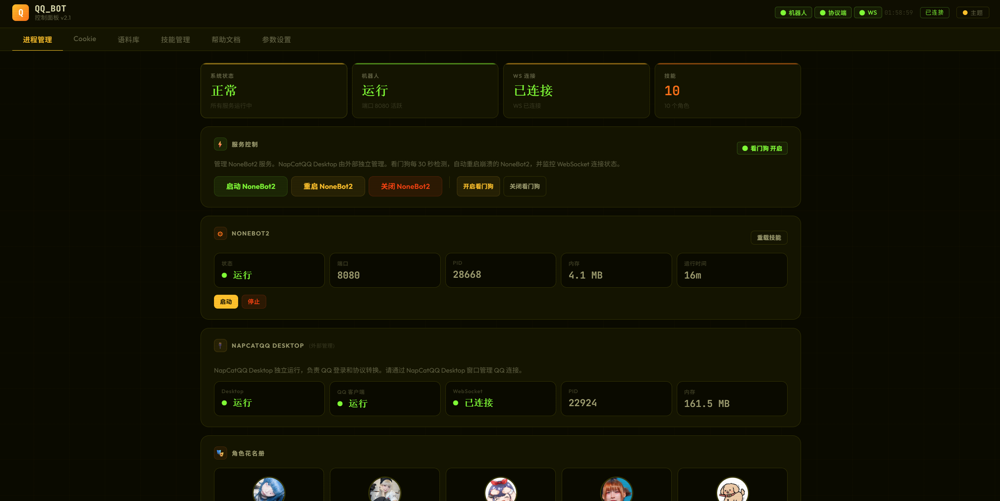

# QQ Bot 多角色扮演系统

基于 NoneBot2 + DeepSeek API + NapCat 的多角色扮演 QQ 机器人，支持语料采集 → Skill 蒸馏 → 实时切换，内置联网搜索和中文 Web 管理面板。

## 架构

```
QQ 客户端 ←→ NapCat (OneBot v11) ←WebSocket→ NoneBot2 (port 8080)
                                                      ↕
                                                zyw_chat 插件
                                                ├─ DeepSeek / OpenAI API
                                                └─ 百度+微博+搜狗+DDG 联网搜索

Dashboard (port 8501) ←→ 进程管理 / 语料采集 / Skill 蒸馏 / 头像管理 / 热重载
```

## 新手上路

### 前置条件

| 软件 | 要求 | 下载 |
|------|------|------|
| Python | 3.10+，安装时勾选 "Add to PATH" | [python.org](https://www.python.org/) |
| QQ 桌面版 (QQNT) | 最新版 | [im.qq.com](https://im.qq.com/) |
| NapCat | 最新版 | [NapCatQQ Releases](https://github.com/NapNeko/NapCatQQ/releases) |
| DeepSeek API Key | 注册获取 | [platform.deepseek.com](https://platform.deepseek.com) |

### 安装步骤

**1. 克隆仓库**

```bash
git clone https://github.com/KP-i2/qqbot-multiple-character.git
cd skill_communication
```

**2. 运行安装脚本**

双击 `setup.bat`，会自动：
- 检测 Python 环境
- 创建虚拟环境 `skill_qqbot/`
- 安装所有依赖

**3. 配置**

```bash
# 复制配置模板并编辑
cp qqbot/.env.example qqbot/.env
```

编辑 `qqbot/.env`，填入以下信息：

```bash
DEEPSEEK_API_KEY=sk-你的deepseek-api-key    # 必填，从 platform.deepseek.com 获取
ADMIN_QQ=你的QQ号                            # 必填
DASHBOARD_TOKEN=自定义密码                    # Dashboard 访问密码
DEFAULT_SKILL=761                           # 启动时的默认角色（示例为 761）
```

**4. 安装 NapCat 并配置**

- 从 [NapCatQQ Releases](https://github.com/NapNeko/NapCatQQ/releases) 下载 `NapCat.Shell.Windows.OneKey.zip`
- 解压到 `qqbot/napcat/` 目录下，确保 `NapCatWinBootMain.exe` 在 `qqbot/napcat/NapCat.*.Shell/` 内（目录名含版本号，如 `NapCat.44498.Shell`）
- 运行 `setup_napcat.bat` 写入连接配置

**5. 首次登录 QQ**

```bash
# 启动 NapCat 扫码登录（目录名含版本号，请按实际替换）
cd qqbot\napcat\NapCat.*.Shell
.\NapCatWinBootMain.exe 你的QQ号
```

用手机 QQ 扫码。看到 "NapCat.Core Version: x.x.x" 后关闭窗口。

**6. 启动**

```bat
:: 启动 Bot + NapCat
start_all.bat

:: 启动管理面板（自动打开浏览器）
dashboard_silent.bat
```

打开浏览器访问 `http://localhost:8501`，输入 Dashboard 密码。

## QQ Bot 命令

| 命令 | 说明 | 权限 |
|------|------|------|
| `/skills` | 查看所有可用角色 | 所有人 |
| `/switch <角色名>` | 切换角色 | 仅管理员 |
| `/current` | 查看当前角色和模型 | 所有人 |
| `/reset` | 清空对话记忆 | 所有人 |
| `/reloademoji` | 热重载表情文件 | 仅管理员 |

私聊直接发消息，群聊 @Bot 触发回复。

## 功能特性

### 联网搜索

Bot 内置多源联网搜索，当用户消息包含搜索意图关键词（如"查一下"、"最新"、"是谁"）或 URL 时自动触发，无需手动开启。搜索引擎包括百度、微博、搜狗和 DuckDuckGo Instant Answer，采用多源并行 + 健康检查 + 自动降级策略。搜索结果经 DeepSeek 整合后以自然语言回复。

DeepSeek 的 Function Calling 机制让模型自主决定是否搜索、搜什么、是否跟进网页内容，最多执行 3 轮工具调用。可通过 `.env` 中 `WEB_SEARCH_ENABLED=false` 关闭。

### URL 内容抓取

用户发送的消息中包含 URL 时，Bot 会自动抓取页面内容并注入上下文。支持的特殊链接包括：

- **Bilibili**：解析 BV 号，通过 API 获取视频标题、简介、播放量等信息
- **短链接**：自动解析 302 重定向获取真实地址
- **普通网页**：提取正文内容（去 HTML 标签，截断超长内容）

### 情绪表情系统

Bot 会根据对话内容的情绪自动发送对应的表情图片（GIF/JPG/PNG）。表情文件按情绪分类存放在 `emoji/` 目录下，每个子目录包含一个 `keywords.txt` 定义触发词。

当前支持 10 种情绪分类：angry、biaoxian（表现）、chigua（吃瓜）、ganga（尴尬）、haoqi（好奇）、happy、joker、ota、refuse（拒绝）、sad。

触发规则：50% 概率触发，同一用户 60 秒冷却，避免刷屏。管理员可通过 `/reloademoji` 命令热重载表情文件。

### 流式输出

Bot 默认启用流式回复，先通过一次非流式"探测"判断是否需要工具调用，若为普通文本回复则切换为流式输出，分段发送。流式参数可通过 Dashboard 参数设置页动态调整，无需重启。

### 用户画像

Bot 会在对话过程中自动提取用户的简要画像（称呼偏好、兴趣话题等），作为上下文注入后续回复，让角色"记住"对方的特点。画像定期更新，不影响对话性能。

### 双 Provider 回退

支持 DeepSeek 和 OpenAI 两套 LLM Provider。当 OpenAI 启用时作为主选，请求失败自动回退 DeepSeek；每个 Provider 有独立的健康检查和冷却机制（失败后 120 秒冷却），保证服务可用性。

## Dashboard 管理面板

访问 `http://localhost:8501`



| 页面 | 功能 |
|------|------|
| 进程管理 | KPI 总览、服务启停、看门狗、角色花名册 |
| Cookie | 微博 Cookie 状态查看与上传 |
| 语料库 | 微博抓取、QQ 群聊导入、语料 → Skill 生成 |
| 技能管理 | 角色 Skill 列表/编辑/蒸馏/创建 |
| 参数设置 | 运行时参数动态调整 |

## 配置参考

完整配置项见 `qqbot/.env.example`：

| 参数 | 说明 | 默认值 |
|------|------|--------|
| `DEEPSEEK_API_KEY` | DeepSeek API 密钥（必填） | — |
| `DEEPSEEK_MODEL` | 模型名称 | `deepseek-v4-pro` |
| `OPENAI_ENABLED` | 启用 OpenAI 主选 | `false` |
| `ADMIN_QQ` | 管理员 QQ 号 | — |
| `DASHBOARD_TOKEN` | Dashboard 访问密码 | — |
| `DEFAULT_SKILL` | 启动默认角色 | `761` |
| `WEB_SEARCH_ENABLED` | 联网搜索开关 | `true` |
| `ACTIVE_HOURS_START/END` | 活跃时段 | `0 / 23`（全天） |

### 运行时参数（Dashboard 可调）

以下参数可通过 Dashboard「参数设置」页面动态调整，无需重启 Bot：

| 参数 | 说明 | 默认值 |
|------|------|--------|
| `stream_enabled` | 流式输出开关 | `true` |
| `stream_flush_chars` | 流式累积字符数阈值 | `60` |
| `stream_flush_interval` | 流式发送间隔（秒） | `8.0` |
| `stream_flush_min_chars` | 最小累积字符数 | `80` |
| `stream_max_flush_size` | 单次最大发送字符数 | `300` |
| `max_history_rounds` | 最大对话轮数 | `15` |
| `history_ttl_hours` | 对话历史过期时间（小时） | `6` |
| `history_save_interval` | 历史持久化间隔（秒） | `60` |
| `thinking_timer_seconds` | "思考中"提示延迟（秒） | `5` |
| `multi_turn_enabled` | 多轮对话开关 | `true` |

## 目录结构

```
skill_communication/
├── qqbot/                          # QQ Bot 应用
│   ├── bot.py                      # NoneBot2 入口
│   ├── dashboard.py                # Dashboard 入口
│   ├── plugins/zyw_chat/           # 核心聊天插件（模块化）
│   │   ├── __init__.py             # 插件入口，按依赖顺序导入所有模块
│   │   ├── config.py               # 全局配置（API Key、模型、路径、运行时参数）
│   │   ├── provider.py             # LLM Provider 管理与健康检查
│   │   ├── api_client.py           # HTTP API 请求（并发控制、重试、Provider 回退）
│   │   ├── skill_manager.py        # Skill 加载、热重载、角色切换
│   │   ├── history.py              # 对话历史管理（持久化、TTL 清理）
│   │   ├── user_profile.py         # 用户画像提取与摘要
│   │   ├── avatar.py               # QQ 昵称与头像设置（NapCat API）
│   │   ├── search.py               # 联网搜索（百度+微博+搜狗+DDG，健康感知）
│   │   ├── url_fetcher.py          # URL 提取与内容抓取（B站、短链等）
│   │   ├── dsml_cleaner.py         # DSML 标记清理
│   │   ├── message_utils.py        # 消息分段、QQ 表情解析
│   │   ├── rich_message.py         # 富消息解析（QQ 小程序、XML、分享）
│   │   ├── emoji_system.py         # 情绪表情系统（关键词检测、概率触发、冷却）
│   │   ├── llm.py                  # DeepSeek 调用（Function Calling、探测式流式）
│   │   ├── rules.py                # 消息匹配规则（@我、命令识别）
│   │   ├── commands.py             # 命令处理（reset/skills/switch/current/reloademoji）
│   │   ├── chat_handler.py         # 主消息处理流程
│   │   └── lifecycle.py            # 生命周期管理（启动/关闭钩子）
│   ├── dashboard/                  # Web 管理面板
│   │   ├── main.py                 # FastAPI 路由
│   │   ├── monitor.py              # 进程监控 + 看门狗
│   │   ├── skill_manager.py        # Skill CRUD
│   │   ├── weibo_fetcher.py        # 语料采集 + Skill 蒸馏
│   │   └── static/                 # 前端界面
│   ├── skills/                     # 角色 Skill 目录
│   ├── logs/                       # 运行日志（自动轮转）
│   ├── napcat_onebot_config.json   # NapCat 反向 WebSocket 配置模板
│   ├── .env.example                # 配置模板
│   └── pyproject.toml              # NoneBot2 配置
├── scripts/                        # 工具脚本
│   ├── weibo_pw_cookies.py         # 微博语料抓取（Playwright + Cookie）
│   └── archive/                    # 旧版抓取脚本（仅供参考）
├── emoji/                          # 情绪表情资源（按心情分子目录）
├── setup.bat                       # 环境部署脚本
├── setup_napcat.bat                # NapCat 配置写入
├── start_all.bat                   # 一键启动 Bot + NapCat
├── dashboard_silent.bat            # 后台启动 Dashboard
├── requirements.txt                # Python 依赖
├── LICENSE                         # MIT 许可证
├── .gitignore
└── README.md
```

## 运行环境说明

本项目设计为 Windows 本地运行：

- `.bat` 脚本均在 Windows 下测试
- NapCat 使用 Windows 版本（`NapCatWinBootMain.exe`）
- 虚拟环境路径硬编码在 `skill_qqbot/` 目录下

Mac/Linux 用户需自行替换 NapCat 版本、调整启动脚本和路径。

## 日志与调试

所有日志存放在 `qqbot/logs/` 目录下（自动创建），超过 5MB 时自动轮转，保留 3 份备份：

| 文件 | 内容 | 查看时机 |
|------|------|----------|
| `nonebot2.log` | Bot 全部输出（启动、Skill 加载、API 调用、错误堆栈） | Bot 启动失败、API 报错、功能异常 |
| `chat.log` | 对话事件（用户消息、Bot 回复、搜索触发、流式分段） | 查看聊天记录、确认搜索是否触发、调试回复内容 |
| `napcat.log` | NapCat QQ 协议层日志（WebSocket 连接、消息收发） | QQ 消息未收到/未发出、连接断开 |

快速排查命令：

```bash
# 查看最近的错误
tail -50 qqbot/logs/nonebot2.log | grep -i error

# 查看最近对话
tail -20 qqbot/logs/chat.log

# 实时监控 Bot 输出
tail -f qqbot/logs/nonebot2.log
```

## 添加新角色 Skill

每个角色是一个 `qqbot/skills/角色名/` 目录，最少需要两个文件：

### 文件结构

```
qqbot/skills/新角色/
├── SKILL.md       # 元数据（角色名、描述、版本）
├── persona.md     # 人设（七层结构：核心规则→关系→表达DNA→情感→冲突→记忆）
└── work.md        # 工作方式（可选）
```

### SKILL.md 模板

```markdown
---
display_name: 角色显示名
description: 一行描述
version: 1.0.0
---
```

### persona.md 结构

```markdown
# 角色名 — Persona

## Layer 0: Core Rules（行为底线）
- 你不做什么 / 永远怎么做

## Layer 1: Context（身份和关系）
- 你是谁，和用户什么关系

## Layer 2: Expression DNA（说话方式）
- 口头禅、节奏、语言特征

## Layer 3: Emotional Logic（情感模式）
- 什么时候开心/沉默/防御

## Layer 4: Conflict and Repair（冲突处理）
- 如何回避冲突、如何修复关系

## Layer 5: Memory Signature（核心记忆）
- 最重要的几个记忆锚点
```

### 创建方式

**方式一：Dashboard 语料蒸馏（推荐）**

1. 在语料库页面抓取微博或导入 QQ 聊天记录
2. 点击语料旁的「生成技能」
3. 选择角色类型（名人/同事/亲密关系），系统自动调用 DeepSeek 生成

**方式二：手动创建**

1. 在 `qqbot/skills/` 下新建目录
2. 创建 `SKILL.md`、`persona.md`、`work.md`
3. 在 Dashboard 技能管理页点击「重载技能」或 Bot 下次收到消息时自动加载

**方式三：Dashboard 创建**

在 Dashboard 技能管理页点击「创建」，填写角色信息后系统自动生成模板文件。

### 头像

在 `photo/角色名/` 下放入 `avatar.jpg` 或 `avatar.png`，Dashboard 角色花名册会自动展示。

## 技术栈

| 组件 | 技术 |
|------|------|
| Bot 框架 | NoneBot2 + OneBot V11 Adapter |
| QQ 协议 | NapCat |
| AI 模型 | DeepSeek / OpenAI（双 Provider 回退） |
| 联网搜索 | 百度 + 微博 + 搜狗 + DuckDuckGo（多源并行，健康检查，自动降级） |
| Dashboard | FastAPI + Uvicorn + WebSocket |
| 前端 | 原生 HTML/CSS/JS, 6 套主题 |
| 语料蒸馏 | DeepSeek API |
| 进程监控 | psutil + asyncio 看门狗 |

## 致谢

本项目的角色 Skill 体系（`.skill` 目录结构、`SKILL.md` 元数据 + `persona.md` 七层人设 + `work.md` 工作方式）以及语料蒸馏为 AI Skill 的理念，源自 [titanwings/colleague-skill](https://github.com/titanwings/colleague-skill)（dot-skill 项目）。该项目提出了将任何人的思维模型、决策框架和表达风格蒸馏为可复用 AI Skill 的方法，本项目的角色蒸馏流程在此基础上进行了针对 QQ Bot 场景的适配与扩展（多源语料采集、微博/QQ 聊天记录导入、Dashboard 可视化蒸馏管理等）。

## License

MIT
